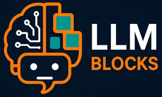

 
# LLMBlocks

[](https://www.python.org/downloads/)
[](https://opensource.org/licenses/MIT)
[](https://github.com/psf/black)

**Modular, scalable Python library for LLM-powered systems using LangChain and LangGraph**

LLMBlocks provides pre-cooked, production-ready building blocks for developing LLM-powered systems. The focus is on abstraction, modularity, and rapid prototyping of agentic workflows, RAG pipelines, memory systems, evaluation tools, and more.

## 🚀 Features

- **Modular Design**: Pluggable components for RAG, agents, memory, prompts, and tools
- **Production Ready**: Built with scalability and maintainability in mind
- **Easy Integration**: Simple interfaces that wrap complex LangChain/LangGraph constructs
- **Configurable**: YAML-driven configuration for easy customization
- **Type Safe**: Full type hints and comprehensive testing
- **Extensible**: Clean abstractions that support custom implementations

## 📦 Installation

### Prerequisites

- Python 3.12+
- [uv](https://github.com/astral-sh/uv) (recommended) or pip

### Install LLMBlocks

```bash
# Using uv (recommended)
uv add llmblocks

# Using pip
pip install llmblocks

# For development
git clone https://github.com/llmblocks/llmblocks.git
cd llmblocks
uv sync --dev
```

### Environment Setup

Create a `.env` file in your project root:

```bash
OPENAI_API_KEY=your_openai_api_key_here
```

## 🏗️ Project Structure

```
llmblocks/
├── blocks/              # High-level pluggable building blocks
│   ├── rag.py          # RAG pipelines (BasicRAG, StreamingRAG, MemoryRAG)
│   ├── agents.py       # Agent implementations
│   ├── memory.py       # Memory systems
│   ├── prompts.py      # Prompt management
│   ├── tools.py        # Tool integrations
│   └── eval.py         # Evaluation tools
├── core/               # Core utilities and base classes
├── playground/         # Streamlit UIs and visualization tools
│   └── rag_playground.py # Interactive RAG testing interface
├── cli/               # Command-line interface
├── config/            # Configuration files (YAML)
├── examples/          # End-to-end examples
├── tests/             # Test suites
├── run_playground.py  # Playground launcher script
├── test_playground.py # Playground test script
└── requirements-playground.txt # Playground dependencies
```

## 🎯 Quick Start

### Basic RAG Pipeline

```python
from llmblocks.blocks.rag import BasicRAG, RAGConfig
from langchain.schema import Document

# Create configuration
config = RAGConfig(
    name="my_rag",
    chunk_size=1000,
    top_k=4,
    llm_model="gpt-3.5-turbo"
)

# Create RAG pipeline
rag = BasicRAG(config)

# Add documents
documents = [
    Document(page_content="Your document content here", metadata={"source": "example"})
]

with rag:
    rag.add_documents(documents)
    
    # Query the pipeline
    answer = rag.query("What is this document about?")
    print(answer)
```

### Streaming RAG

```python
from llmblocks.blocks.rag import create_rag

# Create streaming RAG
rag = create_rag("streaming", streaming_enabled=True)

with rag:
    rag.add_documents(documents)
    
    # Stream the response
    for chunk in rag.query_stream("Tell me about the content"):
        print(chunk, end="", flush=True)
```

### RAG with Memory

```python
from llmblocks.blocks.rag import MemoryRAG

# Create memory-enabled RAG
rag = MemoryRAG(memory_enabled=True)

with rag:
    rag.add_documents(documents)
    
    # Conversation with memory
    answer1 = rag.query("What is the main topic?")
    answer2 = rag.query("Can you elaborate on that?")  # Uses conversation history
```

## 🔧 Configuration

LLMBlocks uses YAML configuration files for easy customization:

### RAG Configuration

LLMBlocks supports multiple LLM providers through a unified configuration interface:

#### OpenAI Configuration
```yaml
# config/openai_rag.yaml
rag:
  name: "openai_rag"
  llm_provider: "openai"
  llm_model: "gpt-4"
  temperature: 0.1
  max_tokens: 1000
  # Set OPENAI_API_KEY environment variable
```

#### Google Gemini Configuration
```yaml
# config/google_rag.yaml
rag:
  name: "google_rag"
  llm_provider: "google"
  llm_model: "gemini-pro"
  temperature: 0.1
  max_tokens: 1000
  # Set GOOGLE_API_KEY environment variable
```

#### Hugging Face Configuration
```yaml
# config/huggingface_rag.yaml
rag:
  name: "huggingface_rag"
  llm_provider: "huggingface"
  llm_model: "meta-llama/Llama-2-7b-chat-hf"
  llm_task: "text-generation"
  temperature: 0.1
  max_tokens: 1000
  # Set HUGGINGFACE_API_KEY environment variable
```

#### Groq Configuration
```yaml
# config/groq_rag.yaml
rag:
  name: "groq_rag"
  llm_provider: "groq"
  llm_model: "llama3-8b-8192"
  temperature: 0.1
  max_tokens: 1000
  # Set GROQ_API_KEY environment variable
```

#### Ollama (Local) Configuration
```yaml
# config/ollama_rag.yaml
rag:
  name: "ollama_rag"
  llm_provider: "ollama"
  llm_model: "llama2"
  llm_base_url: "http://localhost:11434"
  temperature: 0.1
  max_tokens: 1000
  # No API key required for local Ollama
```

### Loading Configuration

```python
from llmblocks.core.config_loader import ConfigLoader

# Load provider-specific configuration
config = ConfigLoader.load_rag_config("config/openai_rag.yaml")
rag = BasicRAG(config)
```

### Using Different Providers Programmatically

```python
from llmblocks.blocks.rag import RAGConfig, create_rag

# OpenAI
openai_config = RAGConfig(
    name="openai_rag",
    llm_provider="openai",
    llm_model="gpt-4",
    temperature=0.1
)

# Google Gemini
google_config = RAGConfig(
    name="google_rag",
    llm_provider="google",
    llm_model="gemini-pro",
    temperature=0.1
)

# Hugging Face
hf_config = RAGConfig(
    name="hf_rag",
    llm_provider="huggingface",
    llm_model="meta-llama/Llama-2-7b-chat-hf",
    llm_task="text-generation",
    temperature=0.1
)

# Groq
groq_config = RAGConfig(
    name="groq_rag",
    llm_provider="groq",
    llm_model="llama3-8b-8192",
    temperature=0.1
)

# Ollama (Local)
ollama_config = RAGConfig(
    name="ollama_rag",
    llm_provider="ollama",
    llm_model="llama2",
    llm_base_url="http://localhost:11434",
    temperature=0.1
)

# Create RAG pipelines
rag = create_rag("basic", openai_config)
```

## 🧩 Available Blocks

### RAG Pipelines

- **BasicRAG**: Simple retrieval and generation
- **StreamingRAG**: Streaming response generation
- **MemoryRAG**: RAG with conversation memory

### Agents (Coming Soon)

- **MultiToolAgent**: Agent with multiple tool capabilities
- **SelfCriticAgent**: Agent with self-criticism capabilities

### Memory Systems (Coming Soon)

- **InMemory**: Simple in-memory storage
- **RedisMemory**: Redis-backed memory
- **ChromaMemory**: ChromaDB-backed memory

### Tools (Coming Soon)

- **WebSearchTool**: Web search capabilities
- **CalculatorTool**: Mathematical operations
- **FileTool**: File system operations

## 🔑 Environment Variables

Set the appropriate API keys for your chosen providers:

```bash
# OpenAI
export OPENAI_API_KEY="your-openai-api-key"

# Google Gemini
export GOOGLE_API_KEY="your-google-api-key"

# Hugging Face
export HUGGINGFACE_API_KEY="your-huggingface-api-key"

# Groq
export GROQ_API_KEY="your-groq-api-key"

# Anthropic
export ANTHROPIC_API_KEY="your-anthropic-api-key"

# Ollama (no API key required for local usage)
```

## 📦 Provider Dependencies

Install additional dependencies for specific providers:

```bash
# Install all provider dependencies
pip install -r requirements_providers.txt

# Or install individually:
pip install langchain-google-genai    # Google Gemini
pip install langchain-community       # Hugging Face, Ollama
pip install langchain-groq            # Groq
pip install langchain-anthropic       # Anthropic
```

## 📚 Examples

Check out the `examples/` directory for comprehensive examples:

- `basic_rag.py`: Basic RAG pipeline usage
- `multi_provider_demo.py`: Multi-provider demonstration
- `playground_demo.py`: Interactive playground usage

## 🧪 Testing

```bash
# Run all tests
pytest

# Run with coverage
pytest --cov=llmblocks

# Run specific test categories
pytest -m unit
pytest -m integration
pytest -m "not slow"
```

## 🛠️ Development

### Setup Development Environment

```bash
git clone https://github.com/llmblocks/llmblocks.git
cd llmblocks
uv sync --dev
pre-commit install
```

### Code Quality

```bash
# Format code
black llmblocks/

# Sort imports
isort llmblocks/

# Type checking
mypy llmblocks/

# Linting
flake8 llmblocks/
```

### Running Examples

```bash
# Basic RAG example
python examples/basic_rag.py

# Multi-tool agent example (coming soon)
python examples/multi_tool_agent.py
```

### 🎮 RAG Playground

The LLMBlocks RAG Playground provides an interactive web interface for testing RAG pipelines:

```bash
# Install playground dependencies
pip install -r requirements-playground.txt

# Launch the playground
python run_playground.py

# Or test the playground setup first
python test_playground.py
```

**Playground Features:**
- 📤 **Document Upload**: Upload files or paste text directly
- ⚙️ **Configuration**: Adjust RAG settings in real-time
- 🧩 **Multiple RAG Types**: Test Basic, Streaming, and Memory RAG
- 💬 **Interactive Chat**: Ask questions and see responses
- 📊 **Metrics**: View document processing statistics
- 📜 **History**: Export conversation history
- 🎨 **Modern UI**: Beautiful, responsive interface

**Quick Start:**
1. Set your OpenAI API key: `export OPENAI_API_KEY='your-key-here'`
2. Run `python run_playground.py`
3. Open your browser to `http://localhost:8501`
4. Upload documents and start chatting!

## 🤝 Contributing

We welcome contributions! Please see our [Contributing Guide](CONTRIBUTING.md) for details.

### Development Workflow

1. Fork the repository
2. Create a feature branch: `git checkout -b feature/amazing-feature`
3. Make your changes
4. Add tests for new functionality
5. Run the test suite: `pytest`
6. Commit your changes: `git commit -m 'Add amazing feature'`
7. Push to the branch: `git push origin feature/amazing-feature`
8. Open a Pull Request

## 📄 License

This project is licensed under the MIT License - see the [LICENSE](LICENSE) file for details.

## 🙏 Acknowledgments

- [LangChain](https://github.com/langchain-ai/langchain) for the foundational framework
- [LangGraph](https://github.com/langchain-ai/langgraph) for workflow orchestration
- [OpenAI](https://openai.com/) for powerful language models
- [ChromaDB](https://www.trychroma.com/) for vector storage

## 📞 Support

- 📧 Email: team@llmblocks.dev
- 🐛 Issues: [GitHub Issues](https://github.com/llmblocks/llmblocks/issues)
- 📖 Documentation: [llmblocks.dev](https://llmblocks.dev)

## 🗺️ Roadmap

### Level 1 MVP (Current)
- ✅ Basic RAG pipelines
- 🔄 Agent implementations
- 🔄 Memory systems
- 🔄 Prompt management
- 🔄 Core utilities

### Level 2 (Next)
- 🔄 CLI interface
- 🔄 Streamlit playground
- 🔄 Advanced agent planning
- 🔄 Dynamic LangGraph graphs

### Level 3 (Future)
- 🔄 Plugin system
- 🔄 Auto-evaluation
- 🔄 Observability dashboard
- 🔄 Enterprise features

---

**Made with ❤️ by the LLMBlocks Team**