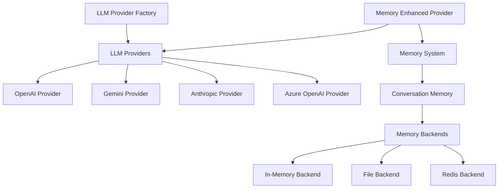

# 📚 API Reference

Complete API reference for LLMBlocks - all classes, methods, and functions with examples.

---

## 🏗️ **Core Architecture**



---

## 🚀 **Quick Reference**

### **Factory Functions**
```python
# LLM Providers
get_provider(provider_name, **kwargs) -> BaseLLMProvider
get_stateful_ai(provider_name, **kwargs) -> MemoryEnhancedLLMProvider
get_persistent_ai(provider_name, session_id, **kwargs) -> MemoryEnhancedLLMProvider

# Memory System
get_conversation_memory(session_id, **kwargs) -> ConversationMemory
get_memory(memory_type, **kwargs) -> BaseMemory
```

---

## 🤖 **LLM Provider API**

### **Factory Functions**

#### **`get_provider(provider_name, config=None, **kwargs)`**
Creates and initializes an LLM provider.

**Parameters:**
- `provider_name` (str): Provider name ("gemini", "openai", "anthropic", "azure_openai")
- `config` (dict, optional): Provider configuration
- `**kwargs`: Additional configuration parameters

**Returns:** `BaseLLMProvider` - Initialized provider instance

**Example:**
```python
# Basic usage
ai = await get_provider("gemini")

# With configuration
ai = await get_provider("gemini", 
    model="gemini-2.0-flash",
    temperature=0.7,
    max_tokens=1000
)

# With config dict
config = {"model": "gpt-4o", "temperature": 0.5}
ai = await get_provider("openai", config=config)
```

#### **`get_stateful_ai(provider_name, memory_config=None, **kwargs)`**
Creates a memory-enhanced LLM provider with conversation memory.

**Parameters:**
- `provider_name` (str): Provider name
- `memory_config` (MemoryConfig, optional): Memory configuration
- `**kwargs`: Provider configuration parameters

**Returns:** `MemoryEnhancedLLMProvider` - Provider with memory

**Example:**
```python
# Basic stateful AI
ai = await get_stateful_ai("gemini")

# With memory configuration
from llmblocks.blocks.memory import MemoryConfig
memory_config = MemoryConfig(backend="file", max_messages=100)
ai = await get_stateful_ai("gemini", memory_config=memory_config)
```

#### **`get_persistent_ai(provider_name, session_id, **kwargs)`**
Creates a persistent AI with file-based memory.

**Parameters:**
- `provider_name` (str): Provider name
- `session_id` (str): Unique session identifier
- `**kwargs`: Provider configuration parameters

**Returns:** `MemoryEnhancedLLMProvider` - Persistent provider

**Example:**
```python
# Persistent AI for user sessions
ai = await get_persistent_ai("gemini", session_id="user_123")
```

---

### **BaseLLMProvider**

Base class for all LLM providers.

#### **Methods**

##### **`async generate(messages, **kwargs) -> LLMResponse`**
Generate a response from the LLM.

**Parameters:**
- `messages` (str | List[LLMMessage] | dict): Input messages
- `**kwargs`: Generation parameters (temperature, max_tokens, etc.)

**Returns:** `LLMResponse` - Generated response

**Example:**
```python
# String input
response = await ai.generate("Hello, world!")

# Message list input
from llmblocks.blocks.llm_provider.base import LLMMessage, LLMRole
messages = [LLMMessage(role=LLMRole.USER, content="Hello!")]
response = await ai.generate(messages)

# Dict input
response = await ai.generate({"role": "user", "content": "Hello!"})
```

##### **`async generate_stream(messages, **kwargs) -> AsyncIterator[LLMResponse]`**
Generate streaming response from the LLM.

**Parameters:**
- `messages` (str | List[LLMMessage] | dict): Input messages
- `**kwargs`: Generation parameters

**Returns:** `AsyncIterator[LLMResponse]` - Streaming response chunks

**Example:**
```python
async for chunk in ai.generate_stream("Tell me a story"):
    print(chunk.content, end="", flush=True)
```

##### **`async initialize() -> None`**
Initialize the provider and its clients.

**Example:**
```python
provider = OpenAIProvider(config)
await provider.initialize()
```

##### **`async health_check() -> dict`**
Check provider health and status.

**Returns:** `dict` - Health status information

**Example:**
```python
health = await ai.health_check()
print(f"Healthy: {health['is_healthy']}")
```

#### **Properties**

##### **`provider_name: str`**
Name of the provider (e.g., "gemini", "openai").

##### **`model: str`**
Current model name.

##### **`is_streaming_enabled: bool`**
Whether streaming is enabled.

##### **`metadata: dict`**
Provider metadata and statistics.

---

### **LLMResponse**

Response object from LLM generation.

#### **Attributes**
- `content` (str): Generated text content
- `model` (str): Model used for generation
- `provider` (str): Provider name
- `usage` (dict, optional): Token usage information
- `metadata` (dict): Additional response metadata

**Example:**
```python
response = await ai.generate("Hello!")
print(f"Content: {response.content}")
print(f"Model: {response.model}")
print(f"Tokens: {response.usage.get('total_tokens') if response.usage else 'N/A'}")
```

---

### **LLMMessage**

Message object for structured conversations.

#### **Attributes**
- `role` (LLMRole): Message role (USER, ASSISTANT, SYSTEM)
- `content` (str): Message content
- `metadata` (dict, optional): Additional metadata

#### **Methods**

##### **`to_langchain_message() -> BaseMessage`**
Convert to LangChain message format.

**Example:**
```python
from llmblocks.blocks.llm_provider.base import LLMMessage, LLMRole

message = LLMMessage(role=LLMRole.USER, content="Hello!")
langchain_msg = message.to_langchain_message()
```

---

## 🧠 **Memory System API**

### **Factory Functions**

#### **`get_conversation_memory(session_id, config=None, **kwargs)`**
Create a conversation memory instance.

**Parameters:**
- `session_id` (str): Unique session identifier
- `config` (MemoryConfig, optional): Memory configuration
- `**kwargs`: Additional configuration parameters

**Returns:** `ConversationMemory` - Memory instance

**Example:**
```python
from llmblocks.blocks.memory import get_conversation_memory

memory = await get_conversation_memory("user_123")
```

#### **`get_memory(memory_type, **kwargs)`**
Create a memory instance of specified type.

**Parameters:**
- `memory_type` (str): Memory type ("conversation")
- `**kwargs`: Configuration parameters

**Returns:** `BaseMemory` - Memory instance

---

### **MemoryConfig**

Configuration for memory systems.

#### **Attributes**
- `backend` (str): Backend type ("in_memory", "file", "redis")
- `max_messages` (int, optional): Maximum messages to store
- `context_strategy` (str): Context management strategy ("recent", "summarized", "all")
- `summary_threshold` (int): When to start summarizing (for "summarized" strategy)
- `preserve_recent` (int): Recent messages to preserve during summarization
- `file_path` (str, optional): File path for file backend
- `redis_url` (str, optional): Redis connection URL
- `auto_save` (bool): Auto-save after each message

**Example:**
```python
from llmblocks.blocks.memory import MemoryConfig

config = MemoryConfig(
    backend="file",
    max_messages=100,
    context_strategy="summarized",
    summary_threshold=50,
    preserve_recent=10,
    file_path="./conversations.json"
)
```

---

### **ConversationMemory**

Manages conversation history and context.

#### **Methods**

##### **`async add_message(role, content, metadata=None) -> None`**
Add a message to the conversation.

**Parameters:**
- `role` (str): Message role ("user", "assistant", "system")
- `content` (str): Message content
- `metadata` (dict, optional): Additional metadata

**Example:**
```python
await memory.add_message("user", "Hello!")
await memory.add_message("assistant", "Hi there!")
```

##### **`async get_messages(limit=None) -> List[MemoryMessage]`**
Retrieve conversation messages.

**Parameters:**
- `limit` (int, optional): Maximum number of messages to return

**Returns:** `List[MemoryMessage]` - List of messages

**Example:**
```python
messages = await memory.get_messages(limit=10)
for msg in messages:
    print(f"{msg.role}: {msg.content}")
```

##### **`async clear() -> None`**
Clear all messages from the conversation.

**Example:**
```python
await memory.clear()
```

##### **`async search(query) -> List[MemoryMessage]`**
Search messages by content.

**Parameters:**
- `query` (str): Search query

**Returns:** `List[MemoryMessage]` - Matching messages

**Example:**
```python
results = await memory.search("pizza")
```

##### **`async get_stats() -> dict`**
Get memory statistics.

**Returns:** `dict` - Statistics information

**Example:**
```python
stats = await memory.get_stats()
print(f"Total messages: {stats['total_messages']}")
```

---

### **MemoryEnhancedLLMProvider**

LLM provider with integrated memory.

#### **Methods**

##### **`async chat(message, **kwargs) -> LLMResponse`**
Chat with memory-aware AI.

**Parameters:**
- `message` (str): User message
- `**kwargs`: Generation parameters

**Returns:** `LLMResponse` - AI response

**Example:**
```python
ai = await get_stateful_ai("gemini")
response = await ai.chat("Remember: I like coffee")
```

##### **`async get_conversation_history() -> List[MemoryMessage]`**
Get full conversation history.

**Returns:** `List[MemoryMessage]` - All messages

**Example:**
```python
history = await ai.get_conversation_history()
```

##### **`async clear_conversation() -> None`**
Clear conversation memory.

**Example:**
```python
await ai.clear_conversation()
```

---

## ⚙️ **Configuration Classes**

### **LLMProviderConfig**

Base configuration for LLM providers.

#### **Common Attributes**
- `provider_name` (str): Provider identifier
- `model` (str): Model name
- `temperature` (float): Randomness (0.0-1.0)
- `max_tokens` (int, optional): Maximum response tokens
- `stream` (bool): Enable streaming
- `timeout` (int): Request timeout in seconds
- `api_key` (str, optional): API key
- `requests_per_minute` (int, optional): Rate limit
- `tokens_per_minute` (int, optional): Token rate limit

---

### **GeminiConfig**

Configuration specific to Gemini provider.

#### **Additional Attributes**
- `top_k` (int): Top-k sampling parameter
- `top_p` (float): Top-p sampling parameter
- `safety_settings` (dict): Safety configuration

**Example:**
```python
from llmblocks.blocks.llm_provider import GeminiConfig

config = GeminiConfig(
    model="gemini-2.0-flash",
    temperature=0.7,
    top_k=40,
    top_p=0.9,
    safety_settings={
        "HARM_CATEGORY_HARASSMENT": "BLOCK_MEDIUM_AND_ABOVE"
    }
)
```

---

### **OpenAIConfig**

Configuration specific to OpenAI provider.

#### **Additional Attributes**
- `presence_penalty` (float): Presence penalty (-2.0 to 2.0)
- `frequency_penalty` (float): Frequency penalty (-2.0 to 2.0)
- `top_p` (float): Top-p sampling
- `seed` (int, optional): Random seed for reproducibility
- `tools` (list, optional): Function calling tools

**Example:**
```python
from llmblocks.blocks.llm_provider import OpenAIConfig

config = OpenAIConfig(
    model="gpt-4o",
    temperature=0.7,
    presence_penalty=0.1,
    frequency_penalty=0.1,
    seed=42
)
```

---

## 🔧 **Utility Functions**

### **Error Handling**

#### **LLMProviderError**
Base exception for provider errors.

#### **RateLimitError**
Raised when rate limits are exceeded.

#### **AuthenticationError**
Raised when API authentication fails.

**Example:**
```python
from llmblocks.blocks.llm_provider.base import LLMProviderError, RateLimitError

try:
    response = await ai.generate("Hello")
except RateLimitError as e:
    print(f"Rate limited. Retry after: {e.retry_after} seconds")
except LLMProviderError as e:
    print(f"Provider error: {e}")
```

---

### **Logging**

#### **Enable Logging**
```python
import os
os.environ["LLMBLOCKS_ENABLE_LOGGING"] = "true"
os.environ["LLMBLOCKS_LOG_FORMAT"] = "json"  # or "readable"
```

#### **Custom Logger**
```python
from llmblocks.core.logger import get_logger

logger = get_logger("my_app")
logger.info("Application started")
```

---

## 🔄 **LangChain Integration**

### **LangChain Memory Adapter**

#### **`LangChainMemoryAdapter(llmblocks_memory)`**
Adapt LLMBlocks memory for LangChain.

**Example:**
```python
from llmblocks.blocks.memory.langchain_integration import LangChainMemoryAdapter

llmblocks_memory = await get_conversation_memory("session_123")
langchain_memory = LangChainMemoryAdapter(llmblocks_memory)

# Use with LangChain
from langchain.chains import ConversationChain
chain = ConversationChain(llm=your_llm, memory=langchain_memory)
```

#### **`from_langchain_memory(langchain_memory, session_id)`**
Convert LangChain memory to LLMBlocks memory.

**Example:**
```python
from langchain.memory import ConversationBufferMemory
from llmblocks.blocks.memory.langchain_integration import from_langchain_memory

langchain_mem = ConversationBufferMemory()
llmblocks_mem = await from_langchain_memory(langchain_mem, "session_123")
```

---

## 📊 **Type Definitions**

### **Enums**

#### **LLMRole**
```python
from enum import Enum

class LLMRole(str, Enum):
    USER = "user"
    ASSISTANT = "assistant"
    SYSTEM = "system"
```

#### **MemoryRole**
```python
from enum import Enum

class MemoryRole(str, Enum):
    USER = "user"
    ASSISTANT = "assistant"
    SYSTEM = "system"
```

#### **BlockStatus**
```python
from enum import Enum

class BlockStatus(str, Enum):
    UNINITIALIZED = "uninitialized"
    INITIALIZING = "initializing"
    READY = "ready"
    ERROR = "error"
```

---

## 🚀 **Advanced Usage**

### **Custom Provider Registration**
```python
from llmblocks.blocks.llm_provider import get_factory

factory = get_factory()
factory.register_provider("custom", CustomProvider)
```

### **Provider Lifecycle Management**
```python
# Manual lifecycle management
provider = OpenAIProvider(config)
await provider.initialize()
# ... use provider ...
await provider._cleanup_impl()
```

### **Batch Processing**
```python
# Process multiple prompts concurrently
prompts = ["Hello", "Goodbye", "Thank you"]
tasks = [ai.generate(prompt) for prompt in prompts]
responses = await asyncio.gather(*tasks)
```

---

## 🔍 **Debugging & Monitoring**

### **Health Checks**
```python
health = await ai.health_check()
print(f"Provider: {health['provider']}")
print(f"Status: {health['status']}")
print(f"Last used: {health['last_used']}")
```

### **Metadata Access**
```python
metadata = ai.metadata
print(f"Total requests: {metadata.get('total_requests', 0)}")
print(f"Total tokens: {metadata.get('total_tokens', 0)}")
```

### **Memory Statistics**
```python
stats = await memory.get_stats()
print(f"Messages: {stats['total_messages']}")
print(f"Memory usage: {stats['memory_usage_mb']} MB")
```

---

## 📚 **Complete Example**

```python
import asyncio
from llmblocks.blocks.llm_provider import get_stateful_ai
from llmblocks.blocks.memory import MemoryConfig

async def main():
    # Configure memory
    memory_config = MemoryConfig(
        backend="file",
        max_messages=100,
        context_strategy="summarized",
        file_path="./conversation.json"
    )
    
    # Create stateful AI
    ai = await get_stateful_ai(
        "gemini",
        memory_config=memory_config,
        temperature=0.7,
        max_tokens=500
    )
    
    # Chat with memory
    response1 = await ai.chat("Hi, I'm Alice, a data scientist from NYC.")
    print(f"AI: {response1.content}")
    
    response2 = await ai.chat("What do you know about me?")
    print(f"AI: {response2.content}")
    
    # Get conversation history
    history = await ai.get_conversation_history()
    print(f"Conversation has {len(history)} messages")
    
    # Health check
    health = await ai.health_check()
    print(f"AI is healthy: {health['is_healthy']}")

if __name__ == "__main__":
    asyncio.run(main())
```

---

## 🎯 **Next Steps**

- **[[Minimal Examples]]** - See API in action
- **[[Advanced Examples]]** - Complex use cases
- **[[Troubleshooting]]** - Common issues and solutions
- **[[Contributing]]** - Contribute to LLMBlocks

**Master the LLMBlocks API! 🚀✨**
