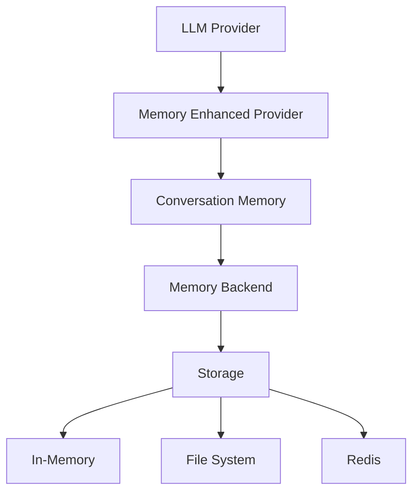

# 🧠 Memory System Guide

Complete guide to LLMBlocks' intelligent memory system that enables stateful AI conversations with automatic context management.

---

## 🎯 **What is the Memory System?**

The Memory System transforms stateless LLM providers into intelligent, context-aware AI assistants that remember your conversations across multiple interactions.

### **Before Memory (Stateless)**
```python
ai = await get_provider("gemini")
response1 = await ai.generate("Hi, I'm Alice from NYC")
response2 = await ai.generate("What's my name?")  # AI doesn't know!
```

### **After Memory (Stateful)**
```python
ai = await get_stateful_ai("gemini")
response1 = await ai.chat("Hi, I'm Alice from NYC")
response2 = await ai.chat("What's my name?")  # AI remembers: "Alice"!
```

---

## 🚀 **Quick Start with Memory**

### **3-Line Stateful AI**
```python
import asyncio
from llmblocks.blocks.llm_provider import get_stateful_ai

async def main():
    # 🧠 Just 3 lines for stateful AI!
    ai = await get_stateful_ai("gemini")
    await ai.chat("I'm Alice, a data scientist from NYC who loves pizza.")
    response = await ai.chat("What do you know about me?")
    print(f"AI: {response.content}")

asyncio.run(main())
```

### **Persistent Memory Across Sessions**
```python
# Session 1
ai = await get_persistent_ai("gemini", session_id="user_123")
await ai.chat("My favorite color is blue")

# Session 2 (later, different process)
ai = await get_persistent_ai("gemini", session_id="user_123")
response = await ai.chat("What's my favorite color?")  # Remembers: "blue"!
```

---

## 🏗️ **Memory Architecture**

### **Core Components**



### **Memory Flow**
1. **User Input** → Memory system stores message
2. **Context Retrieval** → Memory provides relevant context
3. **LLM Processing** → AI processes with full context
4. **Response Storage** → Memory stores AI response
5. **Context Management** → Memory manages context size

---

## 🔧 **Memory Configuration**

### **Memory Backends**

| Backend | Use Case | Persistence | Performance | Setup |
|---------|----------|-------------|-------------|-------|
| **In-Memory** | Development, testing | ❌ No | ⭐⭐⭐⭐⭐ | Zero config |
| **File** | Single user, local apps | ✅ Yes | ⭐⭐⭐⭐ | File path |
| **Redis** | Multi-user, production | ✅ Yes | ⭐⭐⭐⭐⭐ | Redis server |

### **Basic Configuration**
```python
from llmblocks.blocks.memory import MemoryConfig

# In-memory (default)
config = MemoryConfig(backend="in_memory")

# File-based
config = MemoryConfig(
    backend="file",
    file_path="./conversations.json"
)

# Redis-based
config = MemoryConfig(
    backend="redis",
    redis_url="redis://localhost:6379",
    redis_key_prefix="llmblocks:"
)
```

### **Advanced Configuration**
```python
config = MemoryConfig(
    backend="file",
    max_messages=100,           # Max messages to keep
    context_strategy="recent",  # How to manage context
    summary_threshold=50,       # When to summarize
    file_path="./memory.json",
    auto_save=True,            # Auto-save after each message
    compression=True           # Compress stored data
)
```

---

## 💬 **Conversation Memory**

### **Basic Usage**
```python
from llmblocks.blocks.memory import get_conversation_memory

# Create memory instance
memory = await get_conversation_memory("user_123")

# Add messages
await memory.add_message("user", "Hello, I'm Alice")
await memory.add_message("assistant", "Hi Alice! Nice to meet you.")

# Get conversation history
messages = await memory.get_messages()
print(f"Conversation has {len(messages)} messages")

# Clear conversation
await memory.clear()
```

### **Context Strategies**

#### **Recent Messages (Default)**
```python
# Keep only the most recent N messages
config = MemoryConfig(
    context_strategy="recent",
    max_messages=20
)
```

#### **Summarized Context**
```python
# Summarize old messages, keep recent ones
config = MemoryConfig(
    context_strategy="summarized",
    max_messages=50,
    summary_threshold=30,  # Summarize when > 30 messages
    preserve_recent=10     # Keep last 10 messages as-is
)
```

#### **All Messages**
```python
# Keep all messages (use with caution)
config = MemoryConfig(
    context_strategy="all",
    max_messages=None  # No limit
)
```

---

## 🔄 **Integration with LLM Providers**

### **Memory-Enhanced Providers**

#### **Automatic Integration**
```python
# Automatically creates memory-enhanced provider
ai = await get_stateful_ai("gemini", 
    memory_config=MemoryConfig(backend="file")
)

# Use like normal provider, but with memory!
response = await ai.chat("Remember: I like coffee")
```

#### **Manual Integration**
```python
from llmblocks.blocks.llm_provider import get_provider
from llmblocks.blocks.llm_provider.memory_enhanced import MemoryEnhancedLLMProvider
from llmblocks.blocks.memory import get_conversation_memory

# Create base provider
base_provider = await get_provider("gemini")

# Create memory
memory = await get_conversation_memory("session_123")

# Create memory-enhanced provider
ai = MemoryEnhancedLLMProvider(base_provider, memory)

# Now it has memory!
await ai.chat("I'm a Python developer")
response = await ai.chat("What do I do for work?")  # Remembers!
```

---

## 🏪 **Memory Backends**

### **In-Memory Backend**
```python
# Perfect for development and testing
config = MemoryConfig(backend="in_memory")

# Pros: Fast, zero setup
# Cons: Lost when process ends
```

### **File Backend**
```python
# Great for single-user applications
config = MemoryConfig(
    backend="file",
    file_path="./conversations/user_123.json",
    auto_save=True,
    backup_count=5  # Keep 5 backup files
)

# Pros: Persistent, simple
# Cons: Not suitable for concurrent access
```

### **Redis Backend**
```python
# Perfect for production multi-user apps
config = MemoryConfig(
    backend="redis",
    redis_url="redis://localhost:6379",
    redis_key_prefix="myapp:",
    redis_db=0,
    ttl=86400  # Expire after 24 hours
)

# Pros: Fast, concurrent, scalable
# Cons: Requires Redis server
```

---

## 🎛️ **Advanced Memory Features**

### **Session Management**
```python
# Multiple conversation sessions
ai_work = await get_stateful_ai("gemini", session_id="work_chat")
ai_personal = await get_stateful_ai("gemini", session_id="personal_chat")

# Each maintains separate memory
await ai_work.chat("Let's discuss the quarterly report")
await ai_personal.chat("What should I cook for dinner?")
```

### **Memory Search**
```python
# Search conversation history
memory = await get_conversation_memory("user_123")
results = await memory.search("pizza")  # Find messages about pizza

for message in results:
    print(f"{message.role}: {message.content}")
```

### **Memory Statistics**
```python
# Get memory statistics
stats = await memory.get_stats()
print(f"Total messages: {stats['total_messages']}")
print(f"Memory usage: {stats['memory_usage_mb']} MB")
print(f"Oldest message: {stats['oldest_message_date']}")
```

### **Memory Export/Import**
```python
# Export conversation
data = await memory.export_conversation()
with open("backup.json", "w") as f:
    json.dump(data, f)

# Import conversation
with open("backup.json", "r") as f:
    data = json.load(f)
await memory.import_conversation(data)
```

---

## 🔄 **LangChain Integration**

### **LangChain Memory Adapter**
```python
from llmblocks.blocks.memory.langchain_integration import LangChainMemoryAdapter

# Convert LLMBlocks memory to LangChain memory
llmblocks_memory = await get_conversation_memory("session_123")
langchain_memory = LangChainMemoryAdapter(llmblocks_memory)

# Use with LangChain chains
from langchain.chains import ConversationChain
chain = ConversationChain(
    llm=your_langchain_llm,
    memory=langchain_memory
)
```

### **From LangChain Memory**
```python
from langchain.memory import ConversationBufferMemory
from llmblocks.blocks.memory.langchain_integration import from_langchain_memory

# Convert LangChain memory to LLMBlocks memory
langchain_mem = ConversationBufferMemory()
llmblocks_mem = await from_langchain_memory(langchain_mem, session_id="test")
```

---

## 📊 **Memory Performance**

### **Benchmarks**

| Backend | Add Message | Get Messages | Search | Memory Usage |
|---------|-------------|--------------|--------|--------------|
| **In-Memory** | 0.1ms | 0.5ms | 2ms | High |
| **File** | 5ms | 10ms | 50ms | Low |
| **Redis** | 1ms | 3ms | 10ms | Medium |

### **Optimization Tips**

#### **Reduce Memory Usage**
```python
config = MemoryConfig(
    max_messages=50,           # Limit message count
    context_strategy="summarized",  # Use summarization
    compression=True           # Enable compression
)
```

#### **Improve Performance**
```python
config = MemoryConfig(
    backend="redis",           # Use Redis for speed
    batch_size=10,            # Batch operations
    cache_size=100            # Cache recent messages
)
```

---

## 🛠️ **Custom Memory Backends**

### **Creating a Custom Backend**
```python
from llmblocks.blocks.memory.base import MemoryBackend, MemoryMessage

class MyCustomBackend(MemoryBackend):
    async def store_message(self, session_id: str, message: MemoryMessage):
        # Store message in your custom storage
        pass
    
    async def get_messages(self, session_id: str, limit: int = None) -> List[MemoryMessage]:
        # Retrieve messages from your storage
        pass
    
    async def clear_session(self, session_id: str):
        # Clear session data
        pass
    
    async def search_messages(self, session_id: str, query: str) -> List[MemoryMessage]:
        # Search messages
        pass
```

### **Register Custom Backend**
```python
from llmblocks.blocks.memory.backends import get_backend_factory

factory = get_backend_factory()
factory.register_backend("mycustom", MyCustomBackend)

# Use your custom backend
config = MemoryConfig(backend="mycustom", custom_param="value")
```

---

## 🚨 **Troubleshooting**

### **Common Issues**

#### **Memory Not Persisting**
```python
# Ensure you're using a persistent backend
config = MemoryConfig(backend="file")  # Not "in_memory"
```

#### **Context Too Large**
```python
# Use summarization to manage context size
config = MemoryConfig(
    context_strategy="summarized",
    max_messages=50
)
```

#### **Redis Connection Issues**
```python
# Check Redis connection
import redis
r = redis.Redis.from_url("redis://localhost:6379")
r.ping()  # Should return True
```

#### **File Permission Issues**
```python
# Ensure write permissions
import os
os.makedirs("./conversations", exist_ok=True)
```

---

## 📚 **Examples**

### **Customer Support Bot**
```python
async def customer_support():
    ai = await get_persistent_ai("gemini", 
        session_id=f"customer_{customer_id}",
        memory_config=MemoryConfig(
            backend="redis",
            max_messages=100,
            context_strategy="summarized"
        )
    )
    
    # AI remembers entire customer history
    response = await ai.chat(user_message)
    return response.content
```

### **Personal Assistant**
```python
async def personal_assistant():
    ai = await get_persistent_ai("gemini",
        session_id="personal_assistant",
        memory_config=MemoryConfig(
            backend="file",
            file_path="./assistant_memory.json",
            context_strategy="all"  # Remember everything
        )
    )
    
    # Remembers preferences, tasks, conversations
    return await ai.chat("What did we discuss yesterday?")
```

### **Multi-User Chat Application**
```python
async def chat_app(user_id: str, message: str):
    ai = await get_stateful_ai("gemini",
        session_id=f"chat_{user_id}",
        memory_config=MemoryConfig(
            backend="redis",
            redis_url="redis://localhost:6379",
            max_messages=200
        )
    )
    
    return await ai.chat(message)
```

---

## 🎯 **Best Practices**

### **Memory Management**
- Use **summarized** strategy for long conversations
- Set appropriate **max_messages** limits
- Choose the right **backend** for your use case
- Monitor **memory usage** in production

### **Session Management**
- Use meaningful **session_ids**
- Implement session **cleanup** for inactive users
- Consider **TTL** for temporary conversations

### **Performance**
- Use **Redis** for high-performance applications
- Enable **compression** for large conversations
- Implement **caching** for frequently accessed sessions

### **Security**
- Encrypt sensitive conversation data
- Implement proper access controls
- Regular backup of important conversations

---

## 📚 **Next Steps**

- **[[Streaming]]** - Add streaming to memory-enhanced providers
- **[[LangChain Integration]]** - Deep LangChain integration
- **[[Production Deployment]]** - Deploy with memory in production
- **[[API Reference]]** - Complete memory API reference

**Build intelligent, context-aware AI applications! 🧠✨**
